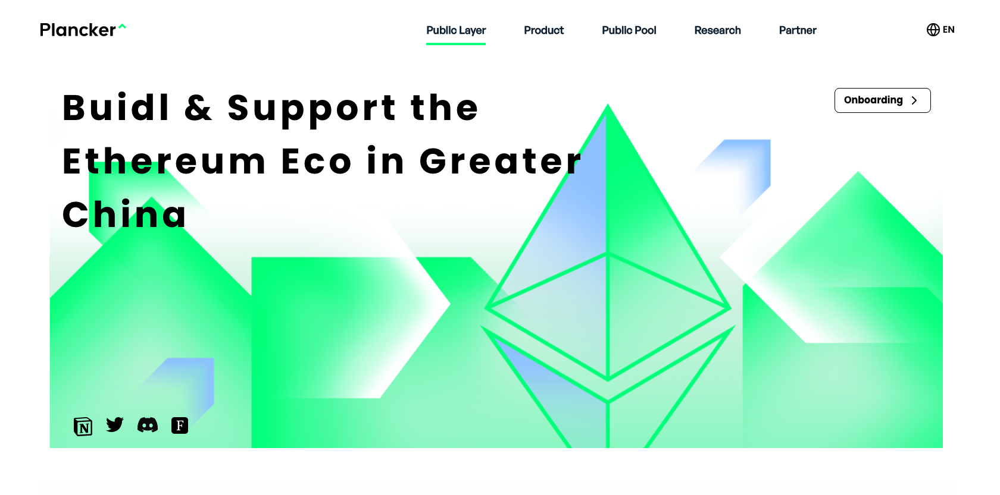

# Plocker^ WebSite




## Demo URL

[Demo](https://super-travesseiro-bd67ef.netlify.app/)
## Web Design
[Design](https://www.figma.com/file/iHd4J7XTpDNMFFEsqcnyVd/Plancker--web-design?node-id=0%3A1&t=juVaXsPAUqWXHqTu-1)
## Features

-   Simple and responsive design
-   [Vue.js v3](https://vuejs.org) with [Vue Router](https://router.vuejs.org)
-   [Tailwind CSS v3](https://tailwindcss.com)
-   Switcher with i18n
-   Vue.js smooth scroll
-   Scroll to top button


## Setup

1. Make sure you have Node JS installed. If you don't have it:

-   [Download it from nodejs.org](https://nodejs.org)
-   [Install it using NVM ](https://github.com/nvm-sh/nvm)
-   If you're on Mac, Homebrew is a good option too:

```
brew install node
```

2. Clone the repo:

```
git clone https://github.com/PlanckerLabs/Website
```

3. Open the project folder:

```
cd plocker-websit
```

4. Install packages and dependencies:

```
npm install
```

5. Start a local dev server at `http://localhost:8080`:

```
npm run serve
```

## Notes

-   Always run `npm install` after pulling new changes
-   I'll be constantly updating this repo as I'll be adding more sections to it, so please always check the projects section of this repo to see what tasks are under todo and in progress
- Please feel free to contact us if you have any questions 😺😺😺 [this](https://plancker.notion.site/)


### License
[MIT](./LICENSE)
